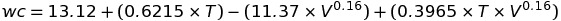

# ICS2O LiveHack #1 Practice

## Practice 1 - f_to_c.py
Write a program that lets you enter a degree measure in Fahrenheit and prints the result in celsius degree measure.

## Practice 2 - days_hours.py
Write a program that lets you enter a number of hours, and that converts it to days and hours. For example, 111 hours = 4 days and 15 hours. (Hint: use the modulus operator).

## Practice 3 - minutes_days.py
Write a program that lets you enter a number of minutes, and that will calculate
the number of days, hours and minutes that represents (Hint: use the modulus operator).

## Practice 4 - windchill.py
Write a program that gets the temperature(celsius) and wind speed (km/h) then computes and outputs  the windchill factor.  

